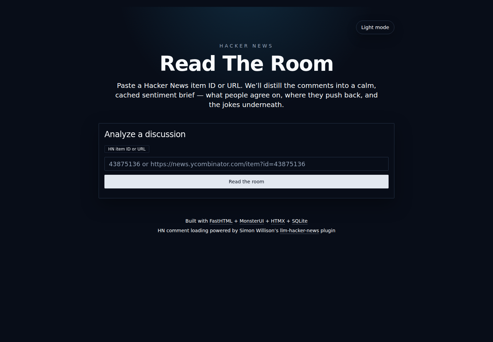
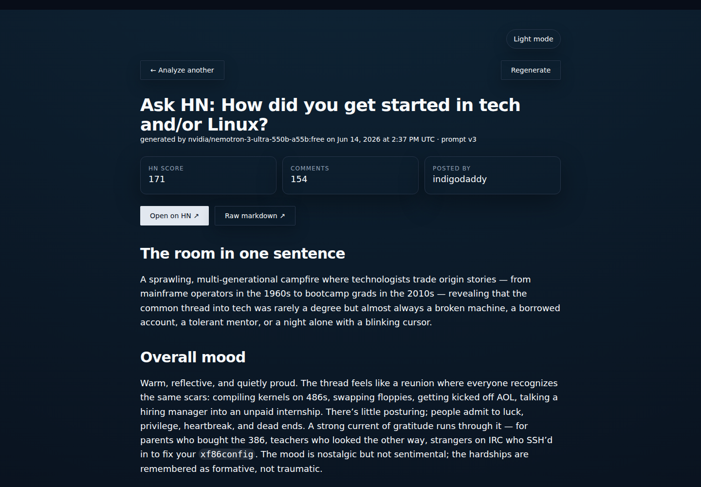

# Hacker News — Read The Room

A FastHTML web app that reads the room of a Hacker News discussion: paste a Hacker News item ID or URL and get a polished Markdown sentiment brief of the comments — consensus, tension, skepticism, representative quotes, outlier opinions, and the bottom line.

Public repo: <https://github.com/jgbrwn/hn-readtheroom>


## Screenshots

### Homepage



### Summary page

Example: [HN item 24670746](https://hn-readtheroom.exe.xyz/item?id=24670746)



## Features

- FastHTML + MonsterUI interface with HTMX loading/polling.
- Accepts either:
  - `43875136`
  - `https://news.ycombinator.com/item?id=43875136`
  - direct route: `/item?id=43875136`
- Strict input validation and Hacker News item validation via the official Firebase API.
- Fetches/normalizes HN comment threads using Simon Willison's [`llm-hacker-news`](https://github.com/simonw/llm-hacker-news) comment processing.
- Summarizes via OpenRouter.
- Default model pair:
  - primary: `qwen/qwen3.5-flash-02-23`
  - backup: `deepseek/deepseek-v4-flash`
- If the primary model errors or times out, the backup is tried. If the backup succeeds, it becomes the preferred model for future generations.
- Optional free-model mode using OpenRouter model discovery for free text-to-text models with >=1M context.
- SQLite caching of HN metadata, model metadata, summaries, generation state, model failures, and rate limits.
- Background generation worker pool; page requests receive a loading state and poll until complete.
- Per-item generation deduplication so multiple users requesting the same item share one generation job.
- Regenerate button.
- Raw Markdown endpoint: `/item.md?id=43875136`.
- Dark mode default with light/dark toggle.
- Systemd service file included.

## Requirements

- Python 3.12+
- An OpenRouter API key
- Linux/systemd for production deployment using the included service file

## Configuration

Create `.env` in the project root:

```env
OPENROUTER_API_KEY=sk-or-v1-your-key
```

Optional environment variables:

```env
# Number of concurrent background summary jobs
GEN_WORKERS=10

# Seconds to wait for a model before trying the next model
OPENROUTER_TIMEOUT=30

# Enable old/free-model discovery mode instead of the paid fast model pair
OPENROUTER_FREE_MODE=0

# SQLite database path
DB_PATH=readtheroom.db

# HTTP port
PORT=8000
```

## Local development

```bash
git clone https://github.com/jgbrwn/hn-readtheroom.git
cd hn-readtheroom
python3 -m venv .venv
. .venv/bin/activate
pip install -r requirements.txt
cp .env.example .env
# edit .env and set OPENROUTER_API_KEY
python app.py
```

Open <http://localhost:8000>.

## Routes

- `GET /` — homepage/form.
- `POST /analyze` — validates form input and redirects to `/item`.
- `GET /item?id=HN_ID` — summary page. Shows loading state while generation is running.
- `GET /status?id=HN_ID` — HTMX polling endpoint.
- `POST /regenerate` — regenerates a summary for an item.
- `GET /item.md?id=HN_ID` — raw Markdown. If missing, generates first and then returns `text/markdown`.
- `GET /healthz` — health check, returns `ok`.

## Production deployment with systemd

From the project directory:

```bash
python3 -m venv .venv
. .venv/bin/activate
pip install -r requirements.txt
```

Create `.env` with your OpenRouter key.

Install the service:

```bash
sudo cp hn-readtheroom.service /etc/systemd/system/hn-readtheroom.service
sudo systemctl daemon-reload
sudo systemctl enable --now hn-readtheroom
```

Manage it:

```bash
sudo systemctl status hn-readtheroom
sudo systemctl restart hn-readtheroom
journalctl -u hn-readtheroom -f
```

The included service assumes:

- project path: `/home/exedev/hn-readtheroom`
- user: `exedev`
- port: `8000`

Edit `hn-readtheroom.service` if your deployment path/user differs.

## Model behavior

By default the app uses two OpenRouter models:

1. `qwen/qwen3.5-flash-02-23`
2. `deepseek/deepseek-v4-flash`

The first model is tried first. If it fails or exceeds `OPENROUTER_TIMEOUT`, the second model is tried. The last successful model is saved in SQLite and becomes the preferred first model for future generations.

To use the legacy free-model discovery mode:

```env
OPENROUTER_FREE_MODE=1
```

Free mode refreshes OpenRouter's model list at most once per day and filters for free text-to-text models with an effective context length of at least 1M tokens.

## Data storage

SQLite database: `readtheroom.db` by default.

Main stored data:

- HN item metadata
- generated Markdown summaries
- prompt version and model name
- generation status/errors
- OpenRouter model metadata
- model failure counts
- lightweight rate-limit buckets

## Security notes

- Inputs are restricted to numeric HN IDs or `news.ycombinator.com/item?id=...` URLs.
- IDs are validated against Hacker News before generation.
- Summary output is rendered as Markdown through MonsterUI/Mistletoe.
- Basic per-client rate limiting is included.

## License

ISC. See [LICENSE](LICENSE).

## Attribution

See [NOTICE](NOTICE) for open source attribution and acknowledgements.
